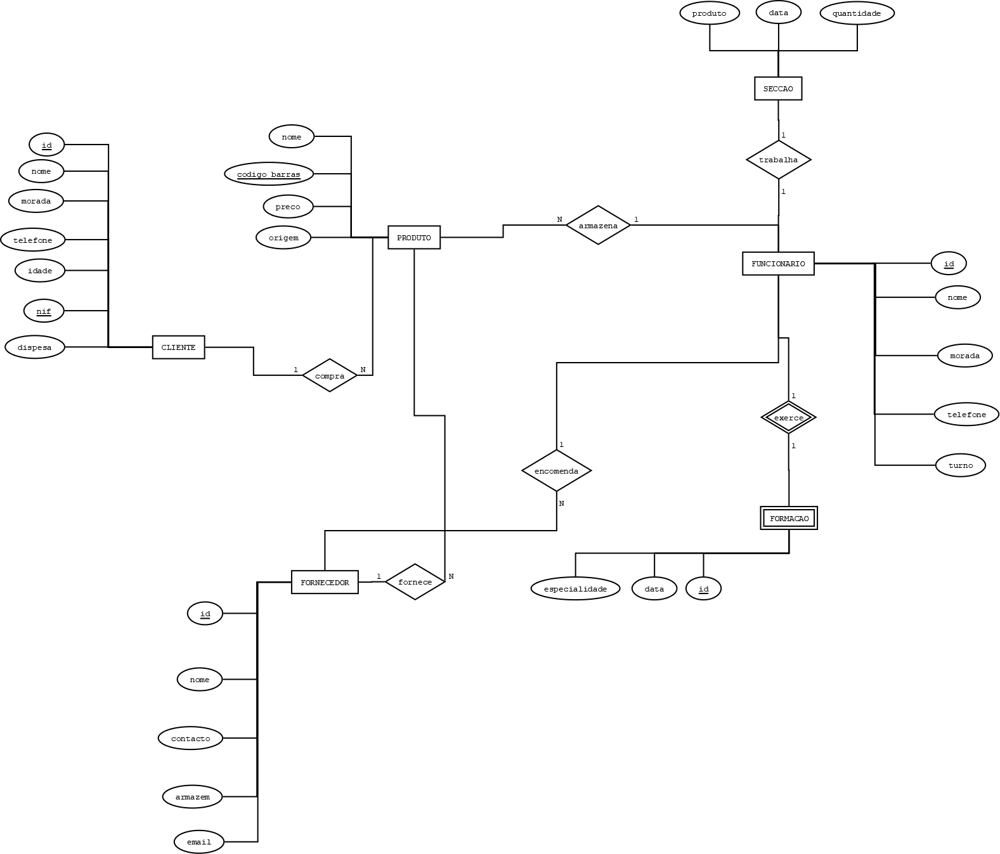

# C3 : Esquema conceptual

## Modelo E/A
_(Introduzir as entidade-tipo e associações do sistema, adicionalmente apresentar o diagrama do modelo Entidade-Associação.)_

Exemplo de inserção de uma imagem:   
   

Modelo E/A

### Entidades

1. Cliente
2. Fornecedor
3. Produto
4. Funcionário
5. Formação
6. Secção

### Associações

1. atende
2. fornece
3. negoceia
4. armazena
5. exerce
6. trabalho

## Regras de negócio adicionais (Restrições)

1. Cliente:
   - Um cliente deve ter um número de identificação único.
   - O número de telefone de um cliente deve ser válido e único.
   - O cliente só pode ter uma forma de pagamento definida.
   - O nome do cliente não pode ser vazio.

2. Fornecedor:
   - Um fornecedor deve ter um número de identificação único.
   - O contacto específico do fornecedor deve ser válido e único.
   - O endereço eletrónico do fornecedor deve ser válido e único.
   - O nome do fornecedor não pode ser vazio.

3. Produto:
   - Cada produto deve ter um código de barras único.
   - O nome do produto não pode ser vazio.
   - O preço do produto deve ser um valor válido e positivo.
   - O produto deve ter uma origem definida.

4. Funcionário:
   - Cada funcionário deve ter um número de identificação único.
   - O número de telefone do funcionário deve ser válido e único.
   - O nome do funcionário não pode ser vazio.
   - A área de trabalho do funcionário deve ser válida (Caixa, Repositor, Atendente).

5. Formação:
   - A formação de um funcionário deve estar associada a um funcionário existente.
   - A experiência de um funcionário deve estar associada a um funcionário existente.

6. Secço:
   - Cada Funcionário deve Trabalha em uma seccao.

Regras de associação adicionais:

1. Atende:
   - Um cliente pode ser atendido por vários funcionários.
   - Um funcionário pode atender vários clientes.
   - A associação "atende" representa o atendimento de um cliente por um funcionário.

2. Fornece:
   - Um fornecedor pode fornecer vários produtos.
   - Um produto pode ser fornecido por vários fornecedores.
   - A associação "fornece" representa o fornecimento de produtos por um fornecedor.

3. Negoceia:
   - Um funcionário pode negociar com vários fornecedores.
   - Um fornecedor pode ser negociado por vários funcionários.
   - A associação "negoceia" representa a negociação entre um funcionário e um fornecedor.

4. Armazena:
   - Um funcionário pode ser responsável por armazenar vários produtos.
   - Um produto pode ser armazenado por vários funcionários.
   - A associação "armazena" representa a responsabilidade de um funcionário em armazenar produtos.

5. Exerce:
   - Um funcionário pode exercer várias formações.
   - Uma formação pode ser exercida por vários funcionários.
   - A associação "exerce" representa a formação exercida por um funcionário.

6. Trabalha:
  - Um funcionário pode trabalhar em uma seccão.
  - A associação "trabalha" representa a seccao onde cada trabalhador trabalha.   

Essas regras de negócio adicionais e restrições ajudam a garantir a integridade e consistência dos dados no sistema de informação da mercearia, além de definir os relacionamentos e limitações entre as entidades e associações. É importante considerar essas regras ao projetar e desenvolver o sistema.
---
[< Previous](rei02.md) | [^ Main](https://github.com/TCM22-SIBD-G03/TCM22-SIBD-G03) | Next >
:--- | :---: | ---: 
